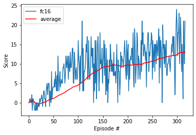
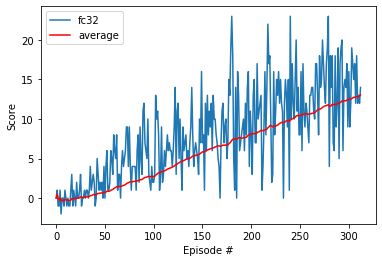
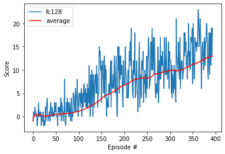
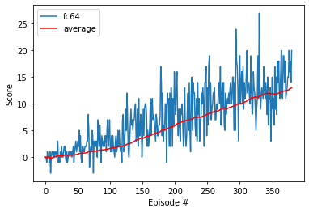
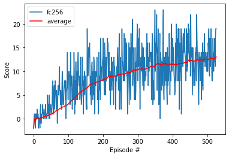
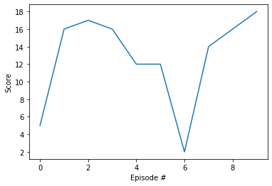

# Navigation

---

In this notebook, you will learn how to use the Unity ML-Agents environment for the first project of the [Deep Reinforcement Learning Nanodegree](https://www.udacity.com/course/deep-reinforcement-learning-nanodegree--nd893).

### 1. Start the Environment

We begin by importing some necessary packages.  If the code cell below returns an error, please revisit the project instructions to double-check that you have installed [Unity ML-Agents](https://github.com/Unity-Technologies/ml-agents/blob/master/docs/Installation.md) and [NumPy](http://www.numpy.org/).


```python
from unityagents import UnityEnvironment
import numpy as np
import torch
from collections import deque
%load_ext autoreload
%autoreload 2
```

Next, we will start the environment!  **_Before running the code cell below_**, change the `file_name` parameter to match the location of the Unity environment that you downloaded.

- **Mac**: `"path/to/Banana.app"`
- **Windows** (x86): `"path/to/Banana_Windows_x86/Banana.exe"`
- **Windows** (x86_64): `"path/to/Banana_Windows_x86_64/Banana.exe"`
- **Linux** (x86): `"path/to/Banana_Linux/Banana.x86"`
- **Linux** (x86_64): `"path/to/Banana_Linux/Banana.x86_64"`
- **Linux** (x86, headless): `"path/to/Banana_Linux_NoVis/Banana.x86"`
- **Linux** (x86_64, headless): `"path/to/Banana_Linux_NoVis/Banana.x86_64"`

For instance, if you are using a Mac, then you downloaded `Banana.app`.  If this file is in the same folder as the notebook, then the line below should appear as follows:
```
env = UnityEnvironment(file_name="Banana.app")
```


```python
env = UnityEnvironment(file_name="./Banana_Linux/Banana.x86_64",no_graphics=True)
```

    INFO:unityagents:
    'Academy' started successfully!
    Unity Academy name: Academy
            Number of Brains: 1
            Number of External Brains : 1
            Lesson number : 0
            Reset Parameters :
    		
    Unity brain name: BananaBrain
            Number of Visual Observations (per agent): 0
            Vector Observation space type: continuous
            Vector Observation space size (per agent): 37
            Number of stacked Vector Observation: 1
            Vector Action space type: discrete
            Vector Action space size (per agent): 4
            Vector Action descriptions: , , , 


Environments contain **_brains_** which are responsible for deciding the actions of their associated agents. Here we check for the first brain available, and set it as the default brain we will be controlling from Python.


```python
# get the default brain
brain_name = env.brain_names[0]
brain = env.brains[brain_name]
```

### 2. Examine the State and Action Spaces

The simulation contains a single agent that navigates a large environment.  At each time step, it has four actions at its disposal:
- `0` - walk forward 
- `1` - walk backward
- `2` - turn left
- `3` - turn right

The state space has `37` dimensions and contains the agent's velocity, along with ray-based perception of objects around agent's forward direction.  A reward of `+1` is provided for collecting a yellow banana, and a reward of `-1` is provided for collecting a blue banana. 

Run the code cell below to print some information about the environment.


```python
# reset the environment
env_info = env.reset(train_mode=True)[brain_name]

# number of agents in the environment
print('Number of agents:', len(env_info.agents))

# number of actions
action_size = brain.vector_action_space_size
print('Number of actions:', action_size)

# examine the state space 
state = env_info.vector_observations[0]
print('States look like:', state)
state_size = len(state)
print('States have length:', state_size)
```

    Number of agents: 1
    Number of actions: 4
    States look like: [1.         0.         0.         0.         0.84408134 0.
     0.         1.         0.         0.0748472  0.         1.
     0.         0.         0.25755    1.         0.         0.
     0.         0.74177343 0.         1.         0.         0.
     0.25854847 0.         0.         1.         0.         0.09355672
     0.         1.         0.         0.         0.31969345 0.
     0.        ]
    States have length: 37


### 3. Take Random Actions in the Environment

In the next code cell, you will learn how to use the Python API to control the agent and receive feedback from the environment.

Once this cell is executed, you will watch the agent's performance, if it selects an action (uniformly) at random with each time step.  A window should pop up that allows you to observe the agent, as it moves through the environment.  

Of course, as part of the project, you'll have to change the code so that the agent is able to use its experience to gradually choose better actions when interacting with the environment!


```python
env_info = env.reset(train_mode=False)[brain_name] # reset the environment
state = env_info.vector_observations[0]            # get the current state
score = 0                                          # initialize the score
while True:
    action = np.random.randint(action_size)        # select an action
    env_info = env.step(action)[brain_name]        # send the action to the environment
    next_state = env_info.vector_observations[0]   # get the next state
    reward = env_info.rewards[0]                   # get the reward
    done = env_info.local_done[0]                  # see if episode has finished
    score += reward                                # update the score
    state = next_state                             # roll over the state to next time step
    if done:                                       # exit loop if episode finished
        break
    
print("Score: {}".format(score))
```

    Score: 0.0


When finished, you can close the environment.


```python
# env.close()
```

### 4. It's Your Turn!

Now it's your turn to train your own agent to solve the environment!  When training the environment, set `train_mode=True`, so that the line for resetting the environment looks like the following:
```python
env_info = env.reset(train_mode=True)[brain_name]
```


```python
## create objects for future refactorization of source codes
class Methods:
    @staticmethod
    def random(self,state_size):
        return np.random.randint(action_size)
    
    
class Agent:
    def __init__(self, action_size = 4,state_size = 37,decision_method = "random"):
        self.action_size = action_size
        self.state_size = state_size
        self.decision_method = decision_method
    def make_decision(self,state):
        ''' make decision on the move'''
        return Methods.random(self.decision_method,state)
    def act(self, state, eps=0.):
        """Returns actions for given state as per current policy.
        
        Params
        ======
            state (array_like): current state
            eps (float): epsilon, for epsilon-greedy action selection
        """
        state = torch.from_numpy(state).float().unsqueeze(0).to(device)
        self.qnetwork_local.eval()
        with torch.no_grad():
            action_values = self.qnetwork_local(state)
        self.qnetwork_local.train()

        # Epsilon-greedy action selection
        if random.random() > eps:
            return np.argmax(action_values.cpu().data.numpy())
        else:
            print('pick random')
            return random.choice(np.arange(self.action_size))

class Game:
    def __init__(self,action_size,state_size, env):
        self.action_size = action_size
        self.state_size = state_size
        self.env = env
        
    def run_game(self,Agent):
        env = self.env
        env_info = env.reset(train_mode=True)[brain_name] # reset the environment
        state = env_info.vector_observations[0]            # get the current state
        score = 0                                          # initialize the score
        while True:
            action = Agent.make_decision(state)
            env_info = env.step(action)[brain_name]        # send the action to the environment
            next_state = env_info.vector_observations[0]   # get the next state
            reward = env_info.rewards[0]                   # get the reward
            done = env_info.local_done[0]                  # see if episode has finished
            score += reward                                # update the score
            state = next_state                             # roll over the state to next time step
            if done:                                       # exit loop if episode finished
                return score
    def run_n_games(self,n,Agent):
        scores = []
        for _ in range(n):
            scores.append(self.run_game(Agent))
        return scores
    
```


```python
def dqn(n_episodes=2000, max_t=1000, eps_start=1.0,
        eps_end=0.01, eps_decay=0.995, train_mode = True,
        ckpt_path = 'checkpoint.pth', solved_score = 13.0):
    """Deep Q-Learning.
    
    Params
    ======
        n_episodes (int): maximum number of training episodes
        max_t (int): maximum number of timesteps per episode
        eps_start (float): starting value of epsilon, for epsilon-greedy action selection
        eps_end (float): minimum value of epsilon
        eps_decay (float): multiplicative factor (per episode) for decreasing epsilon
    """
    scores = []                        # list containing scores from each episode
    moving_avgs = []
    scores_window = deque(maxlen=100)  # last 100 scores
    eps = eps_start                    # initialize epsilon
    for i_episode in range(1, n_episodes+1):
        env_info = env.reset(train_mode=train_mode)[brain_name] # reset environment
        state = env_info.vector_observations[0]                 # get current state        
        score = 0
        for t in range(max_t):
            action = agent.act(state, eps)
            env_info = env.step(action)[brain_name]        # send the action to the environment
            next_state = env_info.vector_observations[0]   # get the next state
            reward = env_info.rewards[0] # get reward
            done = env_info.local_done[0] ## get done
#             next_state, reward, done, _ = env.step(action)
            agent.step(state, action, reward, next_state, done)
            state = next_state
            score += reward
            if done:
                break 
        scores_window.append(score)       # save most recent score to window
        scores.append(score)              # save most recent score
        moving_avg = np.mean(scores_window) # take average of score_window
        moving_avgs.append(moving_avg)
        eps = max(eps_end, eps_decay*eps) # decrease epsilon
        print('\rEpisode {}\tAverage Score: {:.2f}'.format(i_episode, np.mean(scores_window)), end="")
        if i_episode % 100 == 0:
            print('\rEpisode {}\tAverage Score: {:.2f}'.format(i_episode, np.mean(scores_window)))
        if np.mean(scores_window)>=solved_score:
            print('\nEnvironment solved in {:d} episodes!\tAverage Score: {:.2f}'.format(i_episode, np.mean(scores_window)))
            torch.save(agent.qnetwork_local.state_dict(), ckpt_path)
            break
    return scores, moving_avgs
import matplotlib.pyplot as plt
from dqn_agent import Agent

```


```python
def plot_experience(description, scores, avgs):
    '''plot and save scores of each model'''
    fig = plt.figure()
    ax = fig.add_subplot(111)
    plt.plot(np.arange(len(scores)), scores, label= description)
    plt.plot(np.arange(len(scores)), avgs, c='r', label='average')
    plt.ylabel('Score')
    plt.xlabel('Episode #')
    plt.legend(loc='upper left');
    plt.savefig(description+'.png')
    plt.show()
```


```python
# fc16
agent = Agent(state_size=state_size,
              action_size=action_size, seed=0,
              use_double=False, use_dueling=False,fc1=16,fc2=16)
scores, avgs = dqn(n_episodes=1000,
                   eps_decay=0.98,
                   eps_end=0.02,
                   ckpt_path='fc16.ckpt',
                  solved_score=13)


# plot the scores
description = 'fc16'
plot_experience(description, scores, avgs)


```

    device is cuda:0
    Episode 100	Average Score: 4.40
    Episode 200	Average Score: 9.66
    Episode 300	Average Score: 12.35
    Episode 317	Average Score: 13.02
    Environment solved in 317 episodes!	Average Score: 13.02





```python
# fc32
agent = Agent(state_size=state_size,
              action_size=action_size, seed=0,
              use_double=False, use_dueling=False,fc1=32,fc2=32)
scores, avgs = dqn(n_episodes=1000,
                   eps_decay=0.98,
                   eps_end=0.02,
                   ckpt_path='fc32.ckpt',
                  solved_score=13)


# plot the scores
description = 'fc32'
plot_experience(description, scores, avgs)


```

    device is cuda:0
    Episode 100	Average Score: 2.72
    Episode 200	Average Score: 8.07
    Episode 300	Average Score: 12.40
    Episode 313	Average Score: 13.05
    Environment solved in 313 episodes!	Average Score: 13.05





```python
# fc128
agent = Agent(state_size=state_size,
              action_size=action_size, seed=0,
              use_double=False, use_dueling=False,fc1=128,fc2=128)
scores, avgs = dqn(n_episodes=1000,
                   eps_decay=0.98,
                   eps_end=0.02,
                   ckpt_path='fc128.ckpt',
                  solved_score=13)


# plot the scores
description = 'fc128'
plot_experience(description, scores, avgs)

```

    device is cuda:0
    Episode 100	Average Score: 1.08
    Episode 200	Average Score: 6.71
    Episode 300	Average Score: 9.86
    Episode 394	Average Score: 13.01
    Environment solved in 394 episodes!	Average Score: 13.01





```python
# FC 64
agent = Agent(state_size=state_size,
              action_size=action_size, seed=0,
              use_double=False, use_dueling=False)
scores, avgs = dqn(n_episodes=1000,
                   eps_decay=0.99,
                   eps_end=0.01,
                   ckpt_path='fc64.ckpt',
                  solved_score=13)


# plot the scores
description = 'fc64'
plot_experience(description, scores, avgs)
```

    device is cuda:0
    Episode 100	Average Score: 1.61
    Episode 200	Average Score: 5.85
    Episode 300	Average Score: 9.94
    Episode 381	Average Score: 13.02
    Environment solved in 381 episodes!	Average Score: 13.02





```python
# fc256
agent = Agent(state_size=state_size,
              action_size=action_size, seed=0,
              use_double=False, use_dueling=False,fc1=256,fc2=256)
scores, avgs = dqn(n_episodes=1000,
                   eps_decay=0.98,
                   eps_end=0.02,
                   ckpt_path='fc256.ckpt',
                  solved_score=13)


# plot the scores
description = 'fc256'
plot_experience(description, scores, avgs)


```

    device is cuda:0
    Episode 100	Average Score: 3.03
    Episode 200	Average Score: 8.18
    Episode 300	Average Score: 10.41
    Episode 400	Average Score: 11.48
    Episode 500	Average Score: 12.54
    Episode 526	Average Score: 13.03
    Environment solved in 526 episodes!	Average Score: 13.03





```python
## Test the saved agent
checkpoint_path = 'fc256.ckpt'

# initialize the agent
agent = Agent(state_size=state_size, action_size=action_size, seed=0,fc1=256,fc2=256)

# load the weights from file
agent.qnetwork_local.load_state_dict(torch.load(checkpoint_path))

num_episodes = 10
scores = []
for i_episode in range(1,num_episodes+1):
    env_info = env.reset(train_mode=False)[brain_name] # reset the environment
    state = env_info.vector_observations[0]            # get the current state
    score = 0                                          # initialize the score
    while True:
        action = agent.act(state, eps=0)               # select an action
        env_info = env.step(action)[brain_name]        # send the action to the environment
        next_state = env_info.vector_observations[0]   # get the next state
        reward = env_info.rewards[0]                   # get the reward
        done = env_info.local_done[0]                  # see if episode has finished
        #agent.step(state, action, reward, next_state, done) # do the learning

        score += reward                                # update the score
        state = next_state                             # roll over the state to next time step
        if done:                                       # exit loop if episode finished
            scores.append(score)
            print('\rEpisode {}\tAverage Score: {:.2f}'.format(i_episode, np.mean(scores)))
            break

# plot the scores
fig = plt.figure()
ax = fig.add_subplot(111)
plt.plot(np.arange(len(scores)), scores)
plt.ylabel('Score')
plt.xlabel('Episode #')
plt.show()
```

    device is cuda:0
    Episode 1	Average Score: 5.00
    Episode 2	Average Score: 10.50
    Episode 3	Average Score: 12.67
    Episode 4	Average Score: 13.50
    Episode 5	Average Score: 13.20
    Episode 6	Average Score: 13.00
    Episode 7	Average Score: 11.43
    Episode 8	Average Score: 11.75
    Episode 9	Average Score: 12.22
    Episode 10	Average Score: 12.80





```python

```
